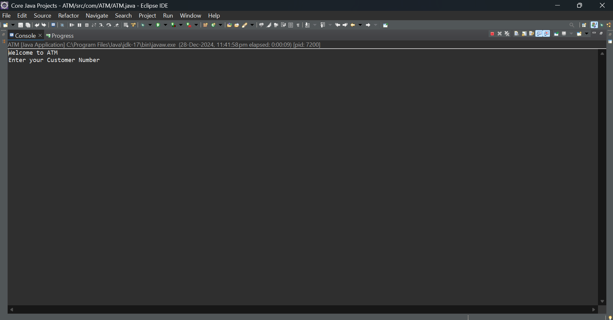
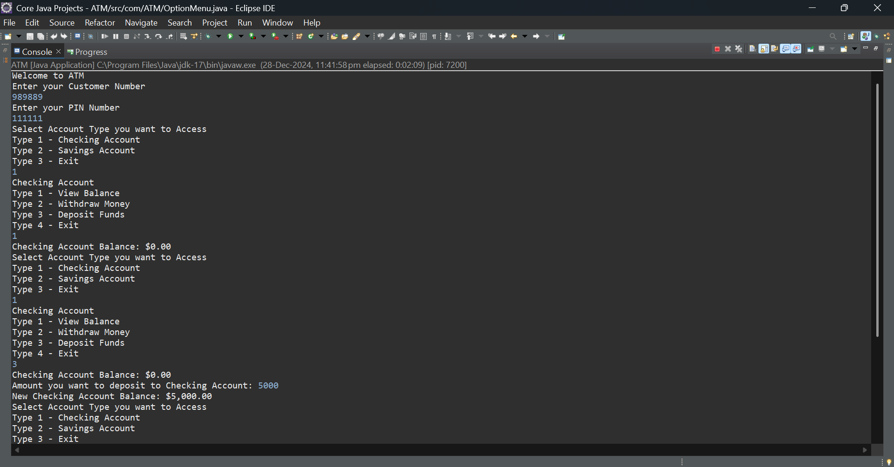
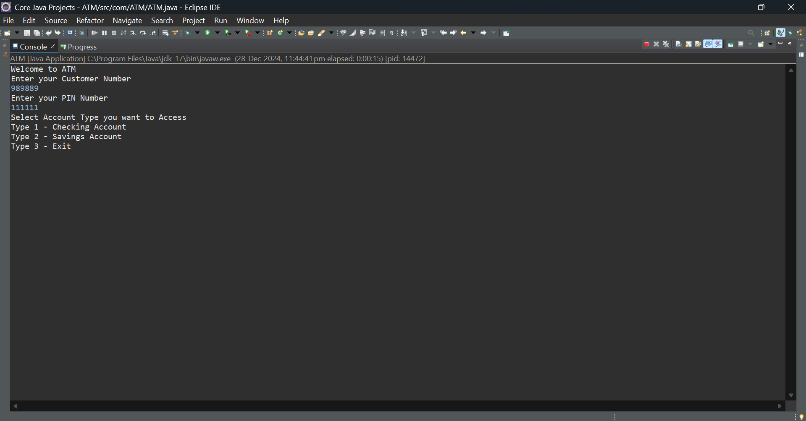

# Simple ATM Project in Java

This is a basic ATM simulation program implemented in Java. It demonstrates fundamental programming concepts such as conditional statements, loops, object-oriented programming, and file handling. The project is designed for beginners to understand how an ATM system works on a basic level.

## Features
- **User Authentication**: Simulates a login system with a PIN.
- **Account Balance Check**: View the current account balance.
- **Deposit Money**: Add funds to the account.
- **Withdraw Money**: Withdraw funds from the account with sufficient balance checks.
- **Exit**: Exit the application safely.

## Technologies Used
- Java (Core)
- Basic Console Input/Output

## How to Run
1. Clone the repository.
2. Open the project in your favorite Java IDE (e.g., IntelliJ, Eclipse, etc.).
3. Compile and run the `ATM.java` file.
4. Follow the instructions displayed on the console.
## Output Screenshot

